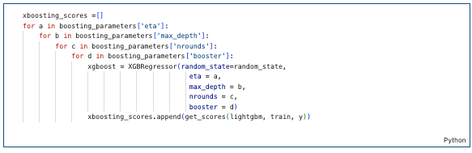
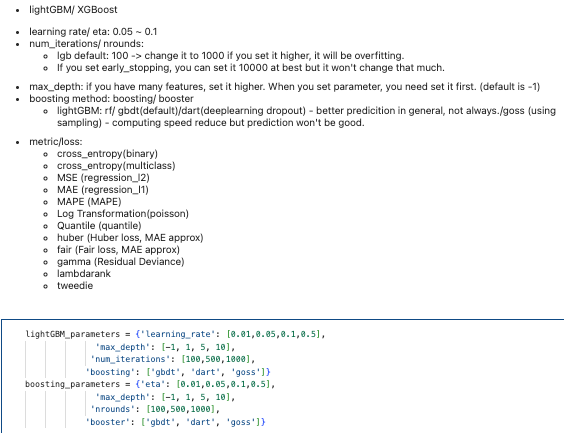
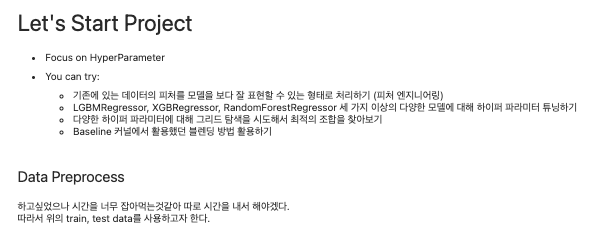

🔑 **PRT(Peer Review Template)**
리뷰자 : 김성연

- []  **1. 주어진 문제를 해결하는 완성된 코드가 제출되었나요? (완성도)**
    - 문제에서 요구하는 최종 결과물이 첨부되었는지 확인
    - 문제를 해결하는 완성된 코드란 프로젝트 루브릭 3개 중 2개, 
    퀘스트 문제 요구조건 등을 지칭
        - 해당 조건을 만족하는 부분의 코드 및 결과물을 캡쳐하여 사진으로 첨부

- submission.csv 코드가 아래 추가되면 될 것 같습니다.
        

- []  **2. 프로젝트에서 핵심적인 부분에 대한 설명이 주석(닥스트링) 및 마크다운 형태로 잘 기록되어있나요? (설명)**
    - 전반적으로 간결한 주석으로 가독성이 좋았습니다.
    - []  모델 선정 이유
    - []  Metrics 선정 이유
    - []  Loss 선정 이유

- []  **3. 체크리스트에 해당하는 항목들을 모두 수행하였나요? (문제 해결)**
    - []  데이터를 분할하여 프로젝트를 진행했나요? (train, validation, test 데이터로 구분)
    - [o]  하이퍼파라미터를 변경해가며 여러 시도를 했나요? (learning rate, dropout rate, unit, batch size, epoch 등)
    - []  각 실험을 시각화하여 비교하였나요?
    - []  모든 실험 결과가 기록되었나요?

- 모델들의 파라미터가 무엇이 있는지 꼼꼼하게 알아보신 점이 인상깊었습니다.

- []  **4. 프로젝트에 대한 회고가 상세히 기록 되어 있나요? (회고, 정리)**
    - []  배운 점
    - [o]  아쉬운 점
    - []  느낀 점
    - []  어려웠던 점

### 리뷰자 느낀점
- hyperparameter를 여러가지로 수정하는 과정에서 직접 검색하셔서 해당 값들의 의미를 찾아본 점이 인상 깊었고 저도 많이 배울 수 있었습니다.
- 머신러닝 모델에서도 dropout같은 기능이 있다는 것도 신기했습니다. 고생많으셨습니다!